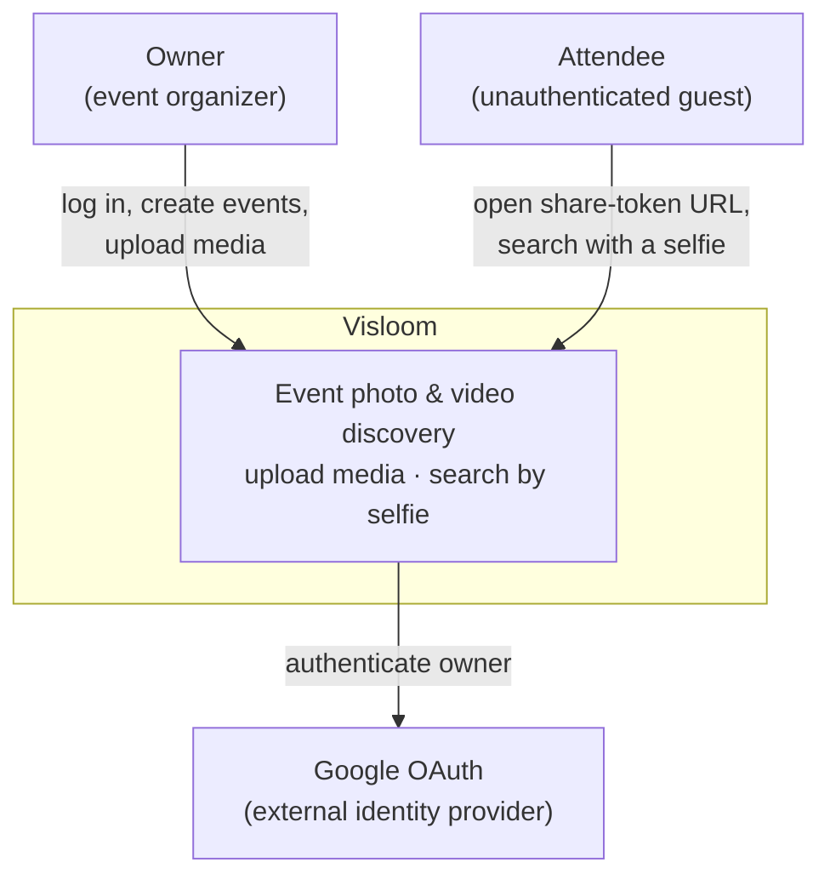
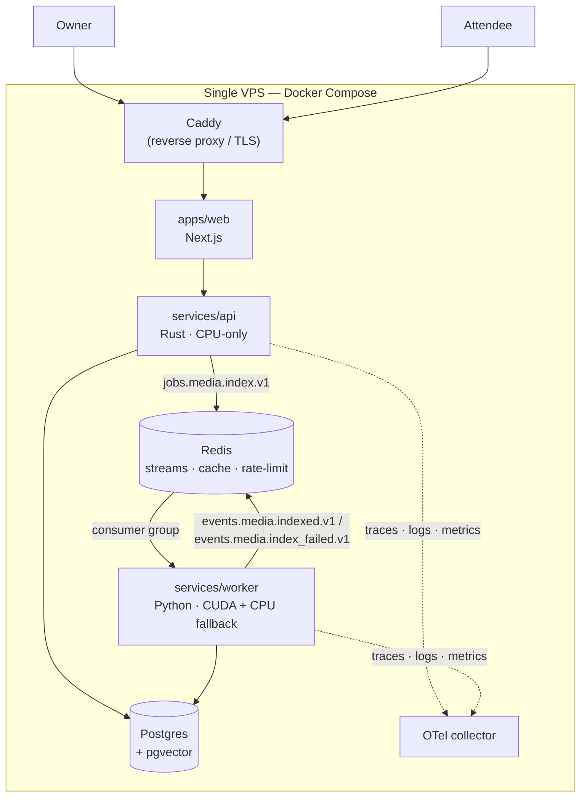
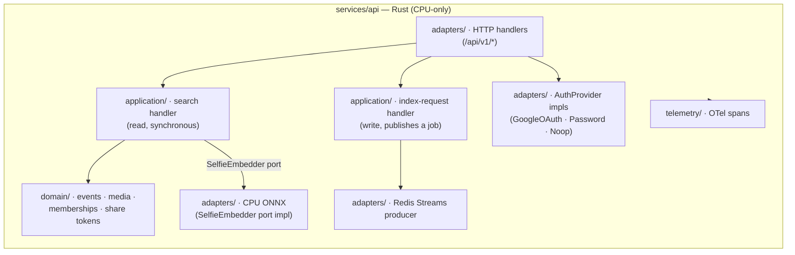
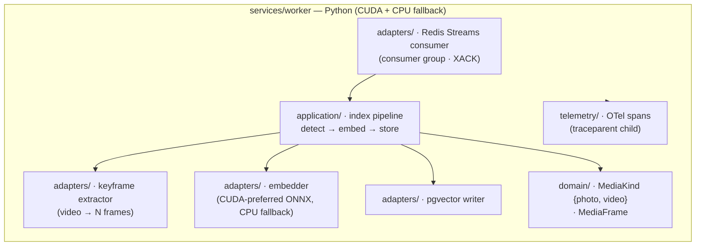
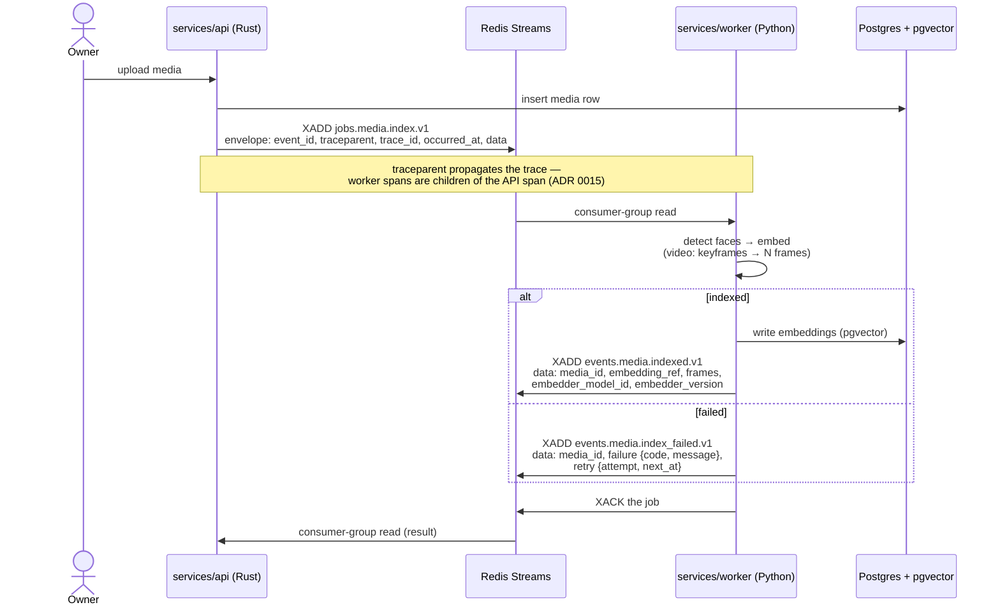
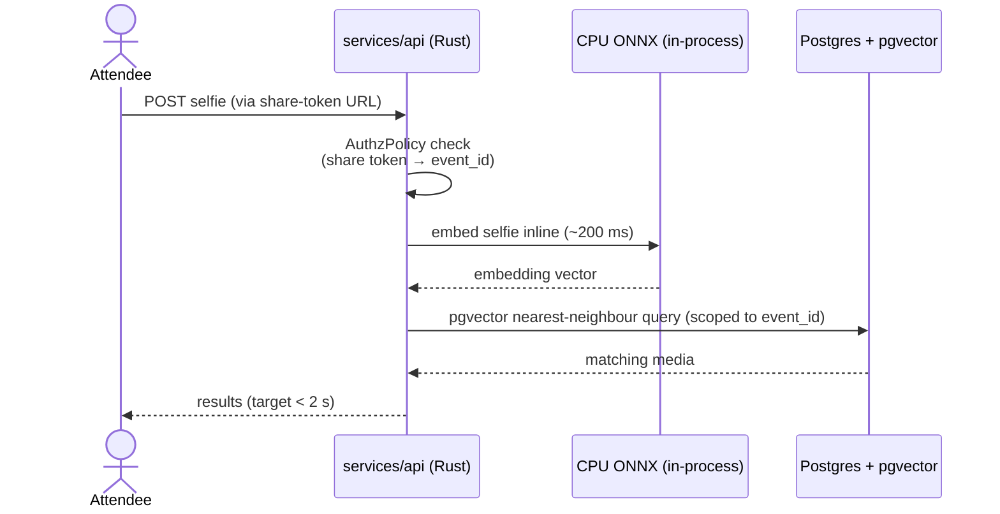
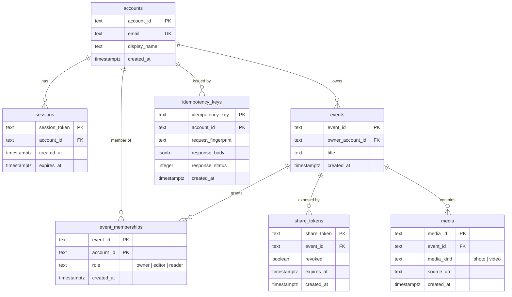

# Visloom architecture overview

Visloom lets an **owner** organize an event, upload its photos and videos,
and lets **attendees** find themselves in that media by uploading a selfie.
It runs as three cooperating runtimes on a single VPS: a **Rust API**, a
**Python worker**, and a **Next.js web** app, backed by Postgres (with
pgvector) and Redis. Media is **indexed asynchronously** on the worker's GPU
and **searched synchronously** inside the API on CPU — the two data-flows that
shape the whole system.

This page is a synthesized view. The [ADRs](../adr/README.md) and
`packages/contracts/schema.sql` are the **source of truth**; where a diagram
and an ADR disagree, the ADR wins. Each section links the ADR(s) it
visualizes. Diagram format is recorded in [ADR 0019](../adr/0019-architecture-diagrams-mermaid.md);
C4 levels are drawn with Mermaid flowcharts rather than the experimental
`C4*` types.

---

## System context

**C4 Level 1.** Two kinds of people use Visloom, and it depends on one
external system. Owners authenticate (Google OAuth or a password backup);
attendees are unauthenticated and reach an event only through an opaque,
revocable share-token URL.

Actors and the auth split come from [ADR 0005](../adr/0005-owner-auth-and-rbac.md)
(owner auth + RBAC) and [ADR 0008](../adr/0008-tenancy-owner-events-and-share-tokens.md)
(tenancy + share tokens).

## Containers & deployment

**C4 Level 2.** All runtimes and infrastructure sit on one VPS under Docker
Compose. Caddy terminates TLS and fronts web + API. The API and worker never
call each other directly — they hand off over **Redis Streams**. Both write
Postgres and export telemetry to an OTel collector.

Runtime split is [ADR 0003](../adr/0003-polyglot-monorepo.md); the layered +
hex structure is [ADR 0002](../adr/0002-layered-hexagonal-architecture.md);
the single-VPS Compose topology is [ADR 0004](../adr/0004-docker-compose-single-vps.md).
Redis's three roles are [ADR 0016](../adr/0016-redis-usage.md).

## Component — API (Rust)

**C4 Level 3.** The API follows the per-runtime baseline of `domain /
application / adapters / telemetry`. Writes with external effects go through
hex **ports** (traits) that adapters implement; reads stay layered. Search
embeds the selfie **in-process** on CPU ONNX — there is no worker hop on the
read path.

Layering + ports are [ADR 0002](../adr/0002-layered-hexagonal-architecture.md);
inline CPU-ONNX search is [ADR 0009](../adr/0009-search-transport-cpu-onnx-inline.md);
the API's CPU-only inference is [ADR 0010](../adr/0010-inference-runtime-worker-cuda-api-cpu.md);
the `NoopAuthProvider` wiring is [ADR 0013](../adr/0013-noop-auth-provider.md).

## Component — Worker (Python)

**C4 Level 3.** The worker reads jobs from a Redis **consumer group**
(at-least-once, `XACK` on completion) and runs the index pipeline. Video is
reduced to keyframes first; both photo and video frames flow through the same
embedder, which prefers CUDA and falls back to CPU at boot.

Layering is [ADR 0002](../adr/0002-layered-hexagonal-architecture.md); the
photo + video-keyframe media model is [ADR 0007](../adr/0007-media-scope-photo-and-video-keyframe.md);
the CUDA + CPU-fallback runtime is [ADR 0010](../adr/0010-inference-runtime-worker-cuda-api-cpu.md).

## Indexing flow (sequence)

The write path is **asynchronous**. The API persists the media row and
publishes `jobs.media.index.v1`; the worker consumes it, embeds, and replies
on one of two result streams. The trace context (`traceparent`) rides inside
the event envelope so the worker's spans attach as children of the API's.

Transport + the three canonical stream names are
[ADR 0006](../adr/0006-redis-streams-versioned-naming.md) and
`../conventions/events.md`; the media model is
[ADR 0007](../adr/0007-media-scope-photo-and-video-keyframe.md); trace
propagation through the envelope is
[ADR 0015](../adr/0015-observability-otel-first.md).

## Search flow (sequence)

The read path is **synchronous** and stays inside the API, targeting under
two seconds. The attendee's share token resolves to an event, the selfie is
embedded in-process on CPU ONNX (~200 ms), and a pgvector nearest-neighbour
query returns the matches. No worker hop, no event schema.

Inline CPU-ONNX search transport is
[ADR 0009](../adr/0009-search-transport-cpu-onnx-inline.md); the share-token
authorization boundary is
[ADR 0008](../adr/0008-tenancy-owner-events-and-share-tokens.md).

## Data model (ER)

The tenant boundary is the **event**: media, memberships, and share tokens
all hang off `events`, and every membership and event ties back to an
`account`. This mirrors `packages/contracts/schema.sql` exactly — the seven
tables present today. Embeddings, pgvector columns, and per-frame rows are
**not** shown: they arrive with the slice-5 migration and are out of scope
for this reference.

Tables and the `role` / `media_kind` enums are
`packages/contracts/schema.sql`; the account/session model is
[ADR 0005](../adr/0005-owner-auth-and-rbac.md); events, memberships, and share
tokens are [ADR 0008](../adr/0008-tenancy-owner-events-and-share-tokens.md);
`media_kind` is [ADR 0007](../adr/0007-media-scope-photo-and-video-keyframe.md).
